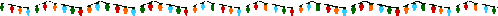

# Advent Of Code sub y{2016}

My JavaScript solutions to [2016 Advent Of Code puzzles](https://adventofcode.com/2015/). 

Getting started

```npm install```

To solve both parts for a specific day

```npm run solve -- <day>```

To solve a part for a specific day

```npm run solve -- <day> <part>```

To solve all puzzles

```npm run solve```



